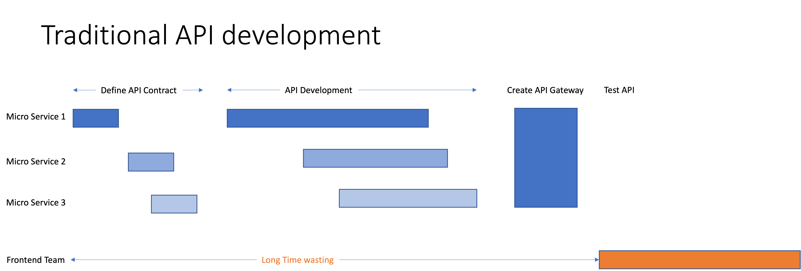
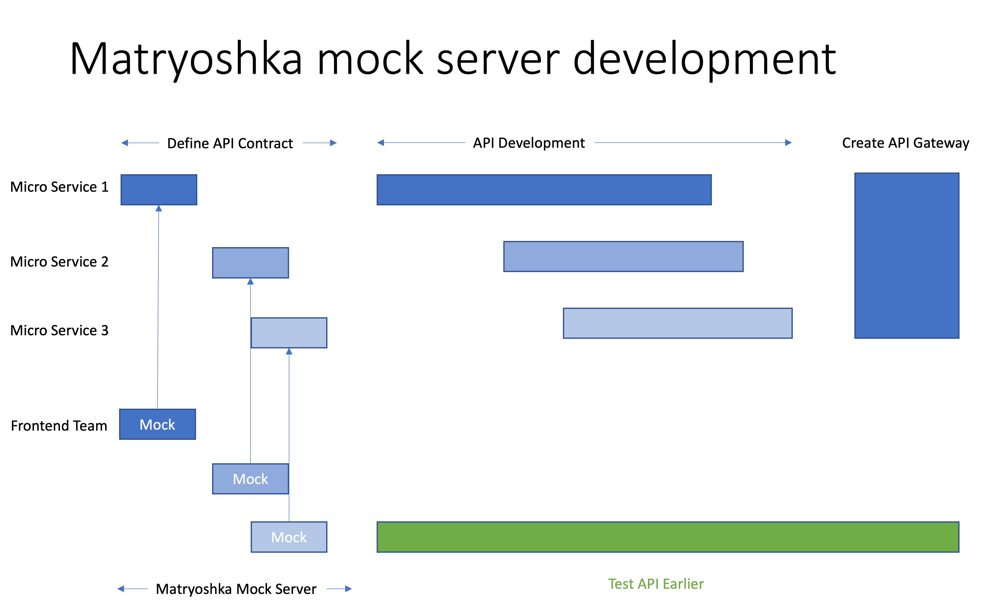
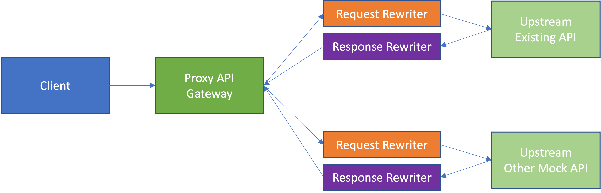

# Design of Matryoshka

## Motivation
The Matryoshka server is developed to create instant mock server for frontend team 
especially when:
* the backend teams can't deliver the API at the beginning phase
* when backend is composed from several micro services which developed by different teams
* when mock API needs to be merged with existing API while. 

> **Traditional API development requires frontend developers to wait for a long time until they can test the api** 


> **With Matryoshka server, frontend developer can directly jump to api testing and integrating without waiting for backend team.**



## Architecture of Matryoshka
Matryoshka consists of a single **Proxy API Gateway** + several of **Request Rewriters** and **Response Rewriters**. 
* The **Proxy API Gateway** handles the routings to **Upstream Servers**. 
* The **Request Rewriter** can rewrite the ```path, query, header, body, method``` of the request send to the **Upstream Server**.
* Once **Upstream Server** response, the **Response Rewriter** will update the ```response data, header, status code``` and finally returns back to client.


## philosophy of Matryoshka

### Declarative Request/Response Rewriter
Mastryoshka server use [fluent interface](https://en.wikipedia.org/wiki/Fluent_interface) to create a declarative [DSL](https://en.wikipedia.org/wiki/Domain-specific_language) to 
create the request/response rewrite logic. For instance, the following code try to rewrite the query parameters and add new fields in response under different status code
The rewrite logic is self explained.
```js
server.updateEndPoint("posts","GET")
  
  // rewrite response only when status code is 200
  .request(
    // posts?page_size&page => posts?size&offset
    RewriteQuery({
      rename:{
        page_size:"size",
        page:"offset"
      }
    })
  )
  .proxy()
  // when status code is 200 add new fields with new_value
  .when(Status(200),
    RewriteResponse({
      add:{
        "[].new_field":"new_value" // add new field on every item inside array
      }
    })
  )
  // when status code is not 200, add new error message
  .when(not(Status(200)),
    RewriteResponse({
      add:{
        "error":"some error message"
      }
    })
  )

```

The Declarative API makes the rewrite logic transparent and you can also use it as an API contract with backend team.    

### Out-of-box but not All-in-one
Matryoshka server itself provides convenient methods Out-of-box to create mock data and declarative method for request/response rewrites. However, matryoshka is 
designed as an all-in-one mock server. There are already many useful Mock API projects like [json-server](https://github.com/typicode/json-server) or 
[mockoon](https://mockoon.com/) there. For example, the **json-server** provides ready to use CRUD API Endpoints Out-of-box. Instead of Reinvent the wheel, 
Matryoshka tries to encourage you to reuse these wonderful projects by providing easy mechanism to integrate these project.
* For instance, you can have your Matryyoshka **Proxy API Gateway** points to your existing API by default and then forward 
  some new API endpoints to a **json-server** with mock implementation.
* Another example is, you want to integrate a search API which still in development by Backend team. You can then forward your search request to
  an ElasticSearch instance and then use **Request/Response Rewriter** to tune it has the same API specification you defien with the Backend team. 
  
With such mechanism, you can quickly create the desired mock API server on your local computer without any communication cost with your backend teams.


